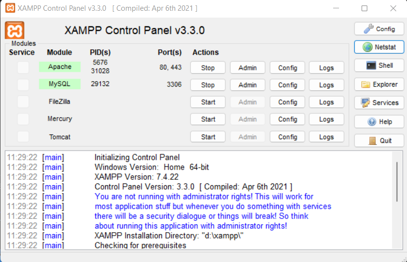

# MiniPro-VisualisationAlgo
<!-- Mini Project Sem 6 : CPU Scheduling Algorithms Visualisation -->

**This project involves development of a visualization technique for CPU scheduling algorithms.** 
Scheduling is a fundamental operating-system function. In a single-processor system, only one process can run at a time; any other must wait until the CPU is free and can be rescheduled. Thus, its scheduling is central to operating-system design
This project has been developed as a comprehensive tool which runs a simulation in real time, and generates useful data to be used for evaluation. A user-friendly and mouse driven graphical user interface has been integrated by making use of the Canvas JS library which helps in visualization the processes. 

This visualization tool can be used for measuring performance of different scheduling algorithms, preemptive and non-preemptive, which helps in better understanding and training of students in domains like Operating System where there is very little practical visualization available, of the underlying system.

Our main aim is to make the understanding process of these algorithms easy for users which will be done by visualizing the working of each algorithm by making use of the CanvasJS library’s stacked column graphs.

# Introduction
In this project we have created visualizations of 4 CPU Scheduling algorithms:
1. First Come First Serve
2. Shortest Job First
3. Shortest Remaining Time First
4. Round Robin

Apart from visualization we have also calculated the performance metrics of each execution which can be seen in a tabular format. The table displays each process's arrival time, burst time, waiting time and turn around time. 

The scope of the mini-project is limited to 15 processes for better visualisation and understanding, but this can be increased. The arrival and burst time inputs are restricted to a maximum of 15 seconds for the same reason.

# Examples:
* Note: Only Arrival time (AT) and Burst time (BT) are required as inputs

1. FCFS

   | Process | AT | BT | WT | TAT |
   |---------|----|----|----|-----|
   |   P1    | 12 |  5 |  5 |  10 |
   |   P2    | 10 |  5 |  2 |   7 |
   |   P3    |  7 |  5 |  0 |   5 |

2. SJF

   | Process | AT | BT | WT | TAT |
   |---------|----|----|----|-----|
   |   P1    |  2 |  4 |  2 |   6 |
   |   P2    |  2 |  7 |  6 |  13 |
   |   P3    |  2 |  2 |  0 |   2 |
   
3. SRTF
   
   | Process | AT | BT | WT | TAT |
   |---------|----|----|----|-----|
   |   P1    |  1 | 14 | 18 |  32 |
   |   P2    |  4 |  8 |  1 |   9 |
   |   P3    |  6 |  9 |  7 |  16 |
   |   P4    | 10 |  1 |  0 |   1 |

4. RR

    Time quantum: 4 secs

   | Process | AT | BT | WT | TAT |
   |---------|----|----|----|-----|
   |   P1    |  2 | 12 | 22 |  34 |
   |   P2    |  4 |  5 | 20 |  25 |
   |   P3    |  1 |  7 | 16 |  23 |
   |   P4    |  5 |  4 | 12 |  16 |
   |   P5    |  4 |  7 | 21 |  28 |

# Tools and Databases
* [XAMPP](https://www.apachefriends.org/download.html): Cross-platform web server solution stack package 
<!-- * [MySQL](https://dev.mysql.com/doc/mysql-installation-excerpt/5.7/en/) -->

# Languages Used:
* [PHP](https://www.php.net/): Backend
* HTML, CSS, JS: Frontend

# Getting Started

**---------- You can skip the installation of this project and directly access it [here](https://visualization-of-algos.herokuapp.com/){:target="_blank"} ----------**


**Step 1: Install XAMPP using the link provided above.**
* Alternatively follow this [video](https://www.youtube.com/watch?v=O6T8YPUmyj8)

**Step 2: Clone the repository in the htdocs folder.**
* For eg if your XAMPP has been installed in C:\Program Files\xampp then navigate to the htdocs folder present in the above path and run the following command:

```
$ https://github.com/Bhavik-20/MiniPro-VisualisationAlgo.git
```

**Step 3: Enable XAMPP enviroment**
* Run the Apache and MySql Module in XAMPP as shown below

<!--  -->

**Step 4: Run Application**
* Open any browser and enter the following URL:
```
$ localhost/MiniPro-VisualisationAlgo/index.php
```